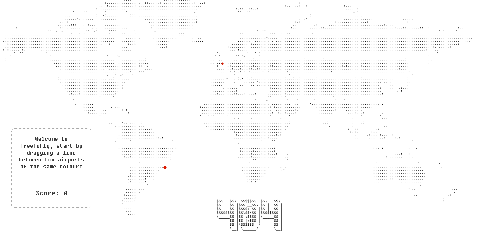
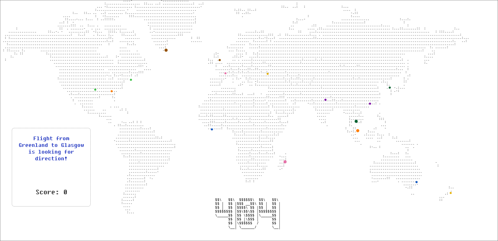
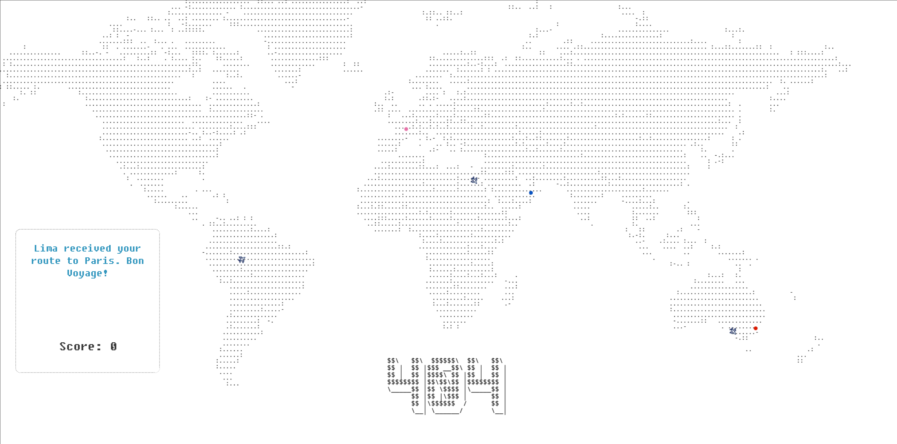
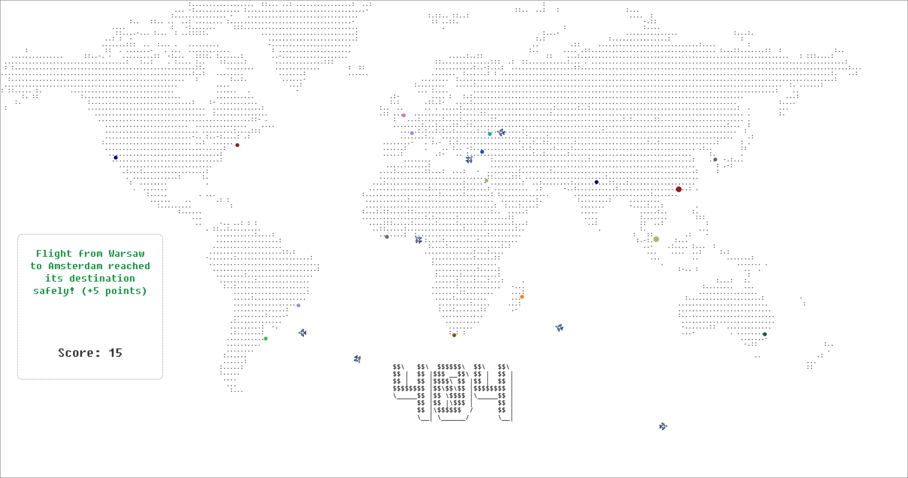
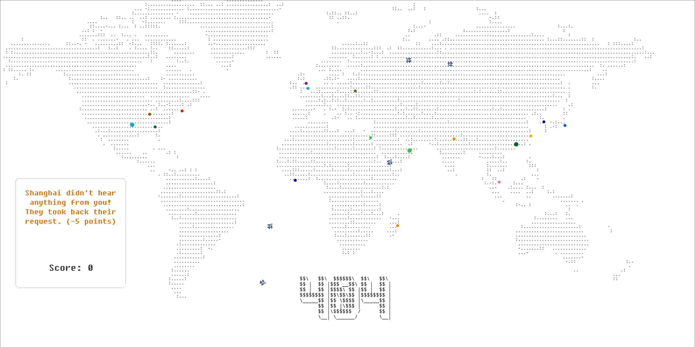
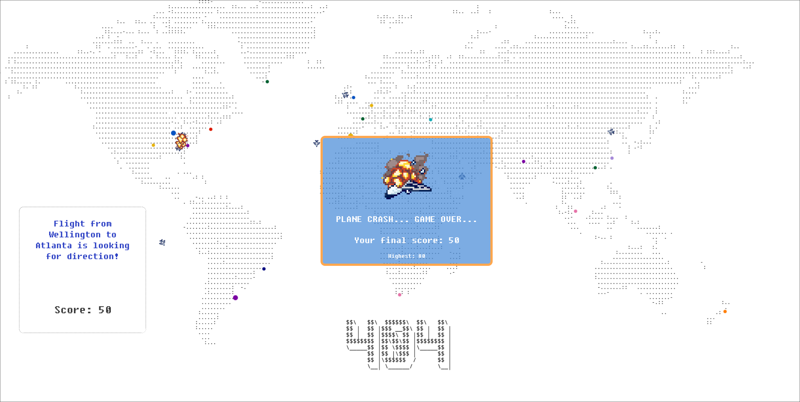
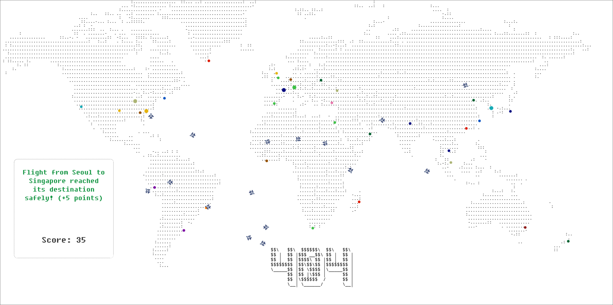

#  FreeToFly
*Created for **Do you have the GUTS? 2025** Hackathon*

### A lightweight Vanilla JS game for error 404 pages

### Team One

- [Andrei Boghean](https://github.com/AndreiBoghean)
- [Calum Cardownie](https://github.com/calumvc)
- [Jack Neilson](https://github.com/jack27106)
- [Joshua Niewczas](https://github.com/hummhu)
- [Lawrence Zhang](https://github.com/RAF-law)

### Requirements
- Node.js
- npm

### Running The Game 
```bash
git clone https://github.com/calumvc/FreeToFly.git 

cd FreeToFly

npx live-server
should automatically open in your browser...
```

### Demo














